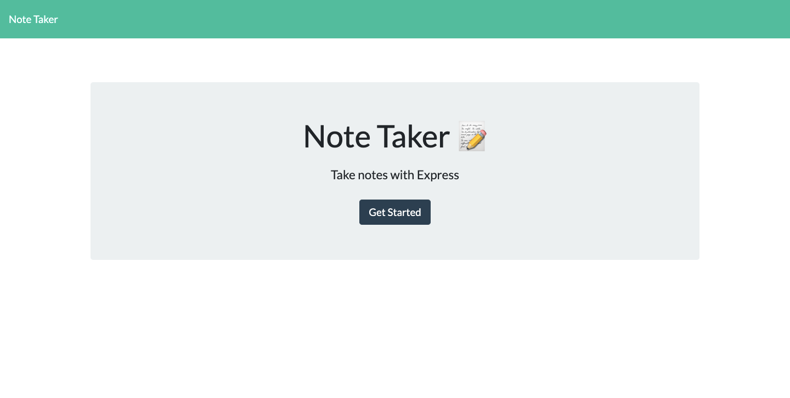
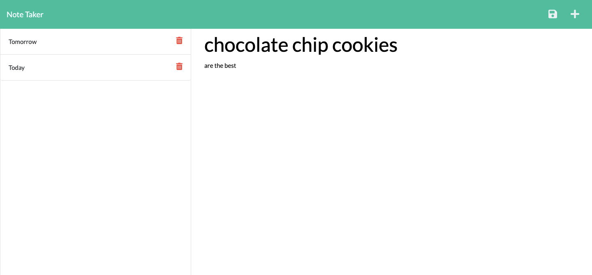
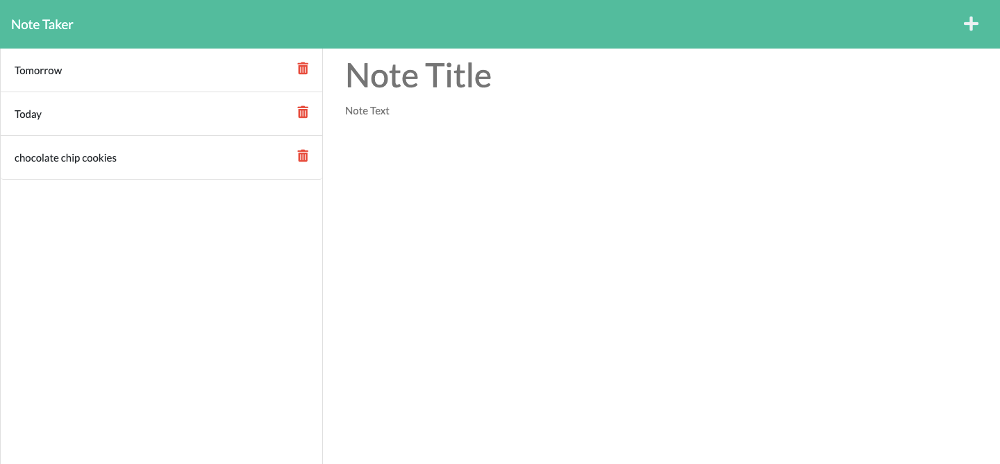

# Note Taker

## Description
This Note Taker use an Express.js back end and will save and retrieve note data from a JSON file.

Users are able to add new notes by clicking on the Save icon, which appears in the navigation at the top of the page when users enter a note title and note text. The new note is saved and appears in the left-hand column. By clicking on the trash icon, the note is removed from the list and the JSON file.

## Built With
* HTML
* CSS
* JavaScript
* Node.js
* Express.js

## Deployed application
<https://obscure-taiga-58114.herokuapp.com/>

## Contribution
< > with ❤️  by Serena Guo

## Screenshots
Landing page:

Write a note:

Save a note:

